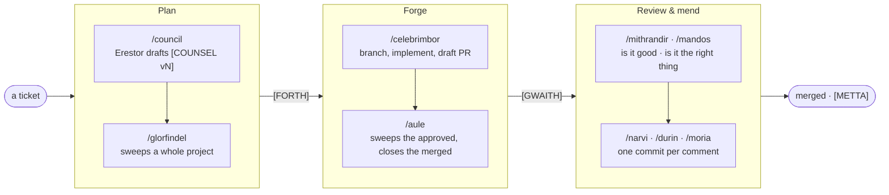
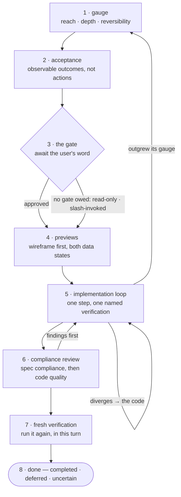
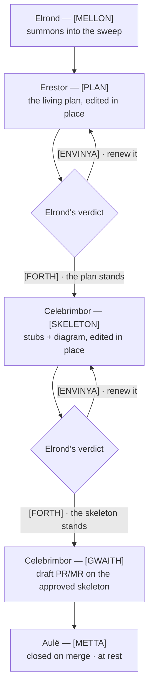

# Skadi

My personal configuration for [Claude Code](https://docs.anthropic.com/en/docs/claude-code)
and [Codex](https://learn.chatgpt.com/docs/codex). Global instructions, skills,
hooks, safety policy, and workflow state are version-controlled here and
installed into paired `~/.claude*` and `~/.codex*` homes by `install.sh`.



Composed over those stages, not before them: **`/anduin`** rides plan and forge for one project; **`/rhovanion`** rides every project in the pipeline list, each gated by a cheap movement probe; **`/amon-sul`** keeps any of them riding on an adaptive watch.

## What's Inside

| Path | Purpose |
|---|---|
| `CLAUDE.md` | Global instructions loaded into every conversation |
| `AGENTS.md` | Runtime-neutral global instructions installed into Codex homes |
| `settings.json` | Model, permissions, plugins, and hook definitions |
| `codex/hooks.json` | Native Codex lifecycle-hook definitions |
| `codex/rules/skadi.rules` | Native Codex command escalation policy |
| `statusline.sh` | Custom status line script |
| `hooks/` | Shell scripts that run before/after tool calls |
| `hooks/lint.sh` | Shellcheck gate over the scripts a branch changed — `./hooks/lint.sh` (add paths to widen it) |
| `skills/` | Custom slash-command skills |
| `docs/` | Style guides, tool guides, and workflow notes referenced from `CLAUDE.md` via `@docs/...` |
| `output-styles/` | Output style definitions, copied into `~/.claude/output-styles/`; `tolkien-narrator` is the default `outputStyle` in `settings.json` |
| `previews/henneth/skadi-theme.css` | Shared parchment stylesheet copied beside the Henneth preview artifacts |
| `install.sh` | Copy installer (idempotent, safe to re-run) |
| `handbook/` | A browsable HTML handbook — the cover plus the plan→forge→review, work-loop, and Rúmil-road pages |
| `handbook.sh` | Open the handbook, served by the situation board — `./handbook.sh` |
| `tests/` | Python tests for the Jira hooks and the skeleton-rung deriver; the rest ride beside their hooks as `*.test.sh` / `test_*.py` |
| `CLAUDE.stub.md` | The one-line marker left in `~/.claude/` pointing at whichever profile root holds the live config |

### Features

- **Grammar check** — Every user message is silently checked for grammar and phrasing. If anything's off, a single corrected line is appended to the response with the changed tokens bolded on both sides (e.g. `"should **i** go?"` → `"should **I** go?"`). A counter hook tallies corrections per session so trends stay visible.
- **Tolkien narrator tone** — Measured cadence, a touch formal, a storyteller's weight. Tight sentences; no breathless filler, no hype.
- **Free-form gate** — Every free-form mutating turn opens with one four-field block — a three-tier size gauge (reach, depth, reversibility), acceptance outcomes, the non-goals a diff must not cross, and a change summary — then waits for the user's word; slash-invoked skills run straight through, and read-only turns are exempt. A `gate-reminder.sh` hook re-injects the gate with every prompt so lower-tier models hold to it. See [The work loop](#the-work-loop).
- **Multi-root install** — `/install` updates every Claude/Codex pair in
  `~/.skadi/install/roots.tsv`; the first `--all` install registers the default,
  personal, and work pairs.
- **Paired agent profiles** — `default`, `personal`, and `work` map to isolated
  Claude and Codex homes. Paired homes share Skadi routing/preferences under
  `~/.skadi/profiles/`, but never authentication or chat history.
- **Native Codex adaptation** — installation renders strict Codex skill
  frontmatter, `$skill` invocations, Codex hook paths, current subagent/tool
  language, and patch-aware safety hooks from the same source skill tree.
- **Source of truth** — `~/.claude*/` and Skadi-owned files under `~/.codex*/`
  are installed copies. Make changes in this repo first; unrelated Codex config,
  authentication, history, and user hooks are preserved.

### Skills

The catalog below uses Claude's `/name` notation. In Codex, invoke the same
installed workflow as `$name`.

- `/install` — Update every registered Claude/Codex profile pair. Repo-local: it lives at `.claude/skills/install/`, not under `skills/`, so it is never itself installed into a profile
- `/commit` — Generate a commit message from the diff and commit after approval; pass `--push` to push after the commit lands
- `/stage` — Interactively stage files
- `/summary` — Summarize staged changes
- `/reset` — Reset workspace to HEAD
- `/branch` — Switch to a target branch, safely handling uncommitted work
- `/celebrant` — Merge the current feature branch into the repo's default branch (`--no-ff`), push, then delete the merged branch local and remote; runs a pre-merge `/argonath` gate (`--quick` by default, full under `--full`), where a Hold warns but does not hard-stop. One confirm before anything destructive
- `/prs` — Show open GitHub PRs requiring attention
- `/mrs` — Show open GitLab merge requests requiring attention
- `/palantir` — Look across both forges from one stone: open GitHub PRs and GitLab MRs needing attention in one combined view, with `⚑` flags on items carrying new comments. Args: `github` / `gitlab` to scope to one forge; `review`, `mine`, or `activity` to filter category
- `/gwaihir` — Gather Outlook mail and Microsoft Teams messages into one read-only "what needs me?" brief — the communications analog of `/palantir`. Surfaces the few items worth a look and the threads wanting a reply; never acts. `[channel] [hours]` scope it
- `/triage` — Pull unread Outlook inbox mail from the last N hours (default 24) through the read-only Microsoft 365 connector, separate signal from noise, and render a tight two-tier summary. Mark-read and move-to-folder run on the Graph write hooks
- `/vor` — Read new Microsoft Teams messages (read-only via Graph delta), cluster threads, surface @-mentions and direct questions, and suggest draft replies in-session — it never posts. Dormant until the work tenant grants the Teams read scopes
- `/amon-din` — Render the most recent CI runs (default 3, override with `[<count>]`) for the current branch (or all branches with `all`). Reads the per-project `ci_routing.md` auto-memory and dispatches to GitLab CI (via `glab`) or TeamCity (via REST). `add` / `remove` verbs (TeamCity only) edit the binding's `buildTypes` list. Read-only against the CI itself. First run on an unbound repo prompts once
- `/jira` — Create or check status of Jira tickets
- `/daily` — Show Jira tasks grouped by status, sorted by priority
- `/working` — Start working on a Jira ticket
- `/eod` — End-of-day scan of configured repos for uncommitted/unpushed work
- `/focus` — Pomodoro focus timer
- `/preflight` — Run periodic maintenance checks and sync overdue items into the todo list
- `/nazgul` — Dispatch the Nine: one agent per check file, aggregating pass/fail verdicts into a single table. Default scope is the diff (uncommitted, branch, or sha range); `/nazgul project` rides over the standing project tree instead. Each check declares its scope via frontmatter
- `/argonath` — Weigh the about-to-be-pushed diff (or the whole tree with the `project` verb): run the project's lint/format/build/test toolchain, scan for secrets, dry-run the merge against the target branch and probe it for the semantic drift a textual merge cannot see — escalating to a real test run on the merged tree when that probe fires — then fold `/nazgul` and `/mithrandir` in as advisory rows — all into one Pass / Hold verdict. Report only; never runs `git push`
- `/council` — Convene a planning council on a tracker ticket: Erestor drafts, Elrond decides, all by comment
- `/glorfindel` — Sweep every open ticket in a project and run the council on each, aggregating one report
- `/celebrimbor` — Forge an approved counsel into a PR/MR: branch off base, dispatch the smith, open the PR/MR, post `[GWAITH]` on the ticket
- `/aule` — Sweep a project for tickets bearing an approved counsel awaiting the forge (`[COUNSEL]` + `[FORTH]`, no `[GWAITH]`), take the first N (default 3), and dispatch `/celebrimbor` per ticket; also closes already-forged tickets whose PR/MR has since merged, threading a `[METTA]` note. `--auto` forges the manifest unattended
- `/anduin` — The council→forge pipeline as one composite sweep: ride `/glorfindel` (plan stage) then `/aule` (skeleton + forge stage) over a project, then print one combined report ending in a plain STIRRED / QUIET verdict. The forge stage runs unattended by default; `--dry-run` or `--confirm` gates it
- `/rhovanion` — Sweep every tracker project in `pipeline_projects.md`, but gate each behind a cheap per-project movement probe — dispatching the full `/anduin` pipeline only where a project's tickets have moved since its last ride. Quiet projects cost one tracker query apiece
- `/amon-sul` — An adaptive in-session watcher over one sweep (`glorfindel`, `aule`, `anduin`, `moria`, or `rhovanion`): run once, read the result, then self-schedule the next ride — tightening to five minutes when work moves, stretching to an hour as the road stays quiet. Honors an optional working-hours window; session-bound, and dies when the session closes
- `/lindir` — Read a PR/MR and render a five-section review brief; with the `approve` verb, ask once and submit an approving review on the forge
- `/mithrandir` — Read a PR/MR and render a multi-axis verdict — five always-on (stability, performance, coding style, maintainability, correctness) plus seven conditional that fire only when the diff touches their domain (test coverage, security, documentation, backward compatibility, observability, dependency hygiene, accessibility & i18n) — with a tier (sound/wavering/off) and short reasoning; with the `comment` verb, ask once and post the verdict to the forge. Tone defaults to lore for chat and plain for forge; `--plain` / `--lore` flags override
- `/mandos` — Weigh a branch, PR, or MR against its ticket's *goal* — Covered / Missing / Scope-crept — read from the ticket's `[COUNSEL]`/`[PLAN]`, its own description, and the parent's acceptance criteria. Where Mithrandir weighs whether the code is *good*, Mandos weighs whether it is the *right* code. Opt-in write verbs: `post` threads a `[DOOM]` verdict on the ticket, `comment` posts it on the PR/MR; `--deep` runs a per-criterion fan-out
- `/narvi` — Address every unaddressed review comment on a GitHub PR or GitLab MR — both inline threads anchored to a diff line *and* overview comments at the PR's top level (Mithrandir's verdicts, free-form review-body notes). Confirms once, then dispatches a smith subagent per comment — one commit per amendment with a `See: <url>` footer marker — pushes the branch, and leaves one short ack per addressed comment on the thread (`Addressed in <sha7>`). De-duplicates across re-runs by grepping the branch's commit log for the marker. Threads stay open; the reviewer eyeballs and resolves with their own hand. After a Narvi run, `/mithrandir bless <url>` re-weighs the amended PR
- `/durin` — Sweep every open PR/MR in a repo's forge bearing unaddressed comments and dispatch `/narvi` per URL, aggregating one report. The forge is auto-detected from the origin remote (GitHub / GitLab). One repo per invocation; `--auto` skips the outer confirm gate
- `/moria` — Sweep every repo in your global mend list (`mend_repos.md`) for PRs/MRs bearing unaddressed comments — loops `/durin` over each root, then prints one combined report ending in a plain STIRRED / QUIET verdict
- `/scribe` — Export a Minerva planning section to YouTrack, Outline, or disk; carries title, scope, Figma screenshot, sub-tasks, and open questions, and updates in place via inline markers
- `/remember` — Save knowledge to your personal knowledge-base repo from any repo: determine the category, suggest sub-categories, and write the note into it. The repo's location is machine-specific, read from `~/.skadi/memory-repo.md`, never hardcoded
- `/rumil` — Translate a product specification — the plan-shaped document a PM or UI designer writes, which reads like a plan but cannot be coded from — into an engineering plan under `docs/plans/`. Takes a text spec and its UI mockups **together** in one invocation, because a feature usually arrives as two documents: the text carries the rules and never draws the flow, the mockups draw the flow and never state the rules. A text spec may be an Outline wiki document read via seshat; given only a ticket key it searches Outline and confirms the title before reading, since the tracker ticket is where a human finds the links and never a spec Rúmil parses. When a wiki spec says it was compiled from a design, a clash between them is read as possible staleness — the question asks which is *current*, not merely which is right. A UI spec may be a `figma.com/design` URL, preferred over screenshots — a design file is structured data, so frame names give the screen vocabulary, same-row `x`/`y` order gives the flow the text spec never contains, slash-named components give design-system bindings, and `get_variable_defs` returns typography and colour as decided values rather than pixels to estimate; absent a Figma connection it falls back to exported PNGs and names what was lost. Wires the two to each other — every screen bound to the rule that governs it, every rule to the screen that exercises it — and raises the three findings that fall out (orphan screen, orphan rule, text-versus-mock contradiction) as numbered questions, never resolving a contradiction quietly; that correspondence is written down nowhere else, existing today only in the head of whichever engineer read both. Binds every product noun to a real `file:line`, refuses to carry the spec's milestones across as steps, turns product acceptance that nothing can fail ("feels instant") into a numbered question rather than an invented threshold, and walks a checklist of the states designers leave undrawn (empty, loading, error, offline, permission, overflow, interruption). Questions are written so their author can answer them without opening the codebase; a step awaiting one carries `[blocked on Qn]`. Names the Purpose and the Acceptance criteria, then sifts the steps through a repeating loop: gauge each against four objective signals (one seam, one check, one revert, no conjunction), split whatever fails, renumber, and gauge again from the top until nothing above minimum remains or four passes elapse; the per-pass verdict table is rendered in chat so the sift can be audited. Steps gather under phase headings, carry global numbers, and declare `[independent]` / `[depends on N]`. A spec that changes screens also gets a UI flow written as a sibling `flow-<slug>.html`, which `/galadriel` inlines beside the plan. Authors plans only — never code, commits, or PRs; `/galadriel` renders what it writes. A one-page diagram of the whole road stands in the handbook as chapter IV, [`handbook/rumil-flow.html`](handbook/rumil-flow.html) — open it with `./handbook.sh`
- `/galadriel` — Render a folder of plan concepts (markdown, default `docs/plans/`) into one self-contained local HTML page: a left selector grouped by lifecycle (shaping/active/done), the chosen concept's preview in the main area, and a progress dashboard below grouping steps into done / in-flight / pending. The Mirror shows what was, is, and may yet be. A step may name the commits that landed it with a `<!-- sha: … -->` marker — the renderer runs `git show` and tucks the colorized patch behind a per-step diff toggle; a concept may name a mockup with a `<!-- preview: file.html -->` marker, inlined into a sandboxed read-only iframe. Step labels and overviews render a safe subset of inline markdown (code/bold/italic). The sidebar width and dashboard height are drag-resizable, the progress band collapses, and the view-state (sizes, collapse, selected concept) persists across re-renders via `localStorage`. Edits are directed in chat and the page re-rendered; deleting is the one change the page makes itself — a select-to-delete mode moves the chosen concepts into the plans folder's `.trash/` (never unlinked) via a standing server, whose link also appears as a **Plans** button on the Situation Board
- `/henneth` — Boot (or reuse) one standing background server, shared across all sessions, serving a live gallery of rendered artifacts; the page lists every wireframe, image, and diagram dropped into `~/.skadi/henneth/` newest-first and follows the latest in its main pane unless pinned. An optional `<artifact>.json` sidecar names a title/note; absent, the filename is humanized. Drop a file and the open screen updates on its own; a row's delete button removes an artifact from the folder (it never edits one)
- `/feanor` — Align a web page (or a booted Flutter app) to a visual reference by an automatic render→compare→mend loop: shoot the target to a PNG, name the deltas against the spec, and edit the source to close them. Exits early when aligned or when progress stalls; a hard `--max` (default 3) is the backstop. Renders into the Henneth window so convergence is watchable
- `/beleg` — Rank an app's Crashlytics issues by impact rather than volume — distinct users (flattened, so one user's retry loop cannot out-shout a fleet-wide fault), trend, version concentration, and whether the blaming frame is code you can actually reach — then read the source at that frame and suggest a fix. Weights live in `hooks/beleg-rubric.json`, each with a criterion line, so the ranking can be argued with without editing code. Prefers the Crashlytics → BigQuery export; when a project carries none the hook exits 2 and the skill falls back to scraping the Firebase console through Chrome, routing those issues through the same scorer via `--from-json` so one value formula stands rather than two that drift. A thinner source is named as such: the brief declares which signals were unavailable rather than implying a completeness it lacks. Bound per repo *and per flavor* in `crash_routing.md`, since one app commonly ships several Firebase projects. Read-only — the `ticket` and `fix` verbs are deliberately unbuilt until the read path has ranked real crashes
- `/growth` — Render a growth dashboard into the Henneth window — DAU/WAU/MAU with week- and month-over-month deltas, a 12-week trend chart, and a 30-day sparkline — from the GA4 → BigQuery export. Read-only, and within BigQuery's free monthly tier
- `/board` — A standing situation board served in the browser: the tickets in progress (tracker status plus an AC rate derived from subtask completion), the metis growth pulse, and a Stability tile (crash-free users % per app, chosen from a live dropdown), each a tile following a JSON channel file on disk. `add` / `remove` manage ticket channels; `refresh` re-fetches every ticket and the growth numbers, and with `--stability-scrape` sweeps each bound app's crash-free number, naming the ones needing a Firebase-console read; `stability-write` persists what that read found; `list` prints the channels. Read-only against Jira, BigQuery and the Crashlytics/GA4 exports
- `/este` — The adherence pulse: a marker-based, per-item scorecard of how faithfully this config's own rules and skills are kept, read across every config root's transcripts. Each row carries a confidence tier and a plain-language criterion (✓ what passes · ✗ what misses) unfolded by an ⓘ button, and the headline reports a figure per tier rather than one average pretending to be certain. Appends each run to history and renders a Henneth dashboard. Read-only over transcripts
- `/fidelity` — The plan-fidelity rate: what fraction of `/mandos` verdicts came back Faithful, and the Missing-versus-Scope-crept split that explains the rest, read from the recorded verdict history and rendered into Henneth. Fills in only as `/mandos` runs — it is not backfilled from past sessions
- `/manwe` — Weigh a rendered UI against its spec — a Henneth wireframe, a Figma reference, a screenshot — or, absent a spec, against a sibling component's actual layout values. Reports `DELTAS` or `DIVERGENT` findings on padding, spacing, sizing, and typography; folded into the Compliance Review when a step edits a component's render
- `/minuial` — The morning-start ritual: boot (or reuse) Henneth, serve the situation board, raise the Galadriel plan mirror where the project has a plans folder, refresh the board (tickets + metis growth), then compute the `/este` adherence pulse — printing every URL. Read-only; composes `/henneth`, `/board`, `/galadriel` and `/este`
- `/handoff` — An async file mailbox between Claude Code sessions: one session leaves a message (or a whole context baton) on a named channel, another reads it on demand or subscribes for live auto-pickup. Sessions standing in the same repo join its channel automatically at start, so no subscribing is needed to reach a sibling session. No server — messages live under `~/.skadi/handoff/`
- `/cleanup-dev` — Free disk space by clearing dev caches and build artifacts
- `/publish` — Build Flutter release archives and collect into `build/publish/`; macOS builds are signed (Developer ID) and notarized
- `/publish-macos` — Bump version, build, and publish a macOS Xcode project to GitHub Releases or the Mac App Store

### Hooks

- **dir-guard** — Block Bash commands and Write/Edit/NotebookEdit file paths that run outside the project directory
- **pre-commit-guard** — Prevent unauthorized commits
- **destructive-warn** — Warn on destructive shell commands
- **secret** — Resolve a credential field for a service from Vaultwarden via `bw serve`, falling back to an env var
- **dart-format** — Run `dart format` after editing Dart files
- **prettier-format** — Run Prettier after editing supported files
- **eslint-check** — Run ESLint after editing JS/TS files
- **grammar-reminder** — Inject the grammar-check reminder on every user prompt
- **session-readme** — On `SessionStart`, inject the project's `README.md` (if any) as additional context
- **grammar-counter** — Count grammar corrections at session stop
- **preflight-check** — Emit the preflight checklist state consumed by `/preflight`
- **jira-daily**, **prs-check**, **mrs-check**, **eod-git-check** — Data collectors for the matching skills
- **prs-activity**, **mrs-activity** — Surface PRs/MRs with new comments via GitHub notifications and GitLab todos for `/palantir`
- **cleanup-dev-*** — Analyze, report, execute, mark-run, and project-scan helpers for `/cleanup-dev` (the last finds per-project build artifacts under `$HOME`, read-only)
- **council-youtrack-fetch**, **council-youtrack-comment**, **council-jira-fetch**, **council-jira-comment** — Tracker I/O for `/council` (YouTrack and Jira)
- **council-plan-html** — Render a `[COUNSEL]` plan to a local HTML preview
- **glorfindel-youtrack-list**, **glorfindel-jira-list** — List open tickets matching a filter for `/glorfindel`
- **forge-github-pr**, **forge-gitlab-mr** — Push a branch and open a PR/MR on GitHub or GitLab via `gh`/`glab`; body taken from stdin, optional `--assignee` (used by `/celebrimbor` and `/working`)
- **aule-github-merged**, **aule-gitlab-merged** — Report whether a forged ticket's PR/MR has since merged, for `/aule`'s close pass
- **lindir-github-pr**, **lindir-gitlab-mr** — Read a PR/MR via `gh`/`glab` and emit a JSON brief for `/lindir`
- **lindir-github-approve**, **lindir-gitlab-approve** — Submit an approving review on a PR/MR via `gh`/`glab` for `/lindir approve`
- **mithrandir-github-comment**, **mithrandir-gitlab-comment** — Post a comment on a PR/MR via `gh`/`glab` for `/mithrandir comment`; body taken from stdin
- **mithrandir-github-prior**, **mithrandir-gitlab-prior** — Find Mithrandir's prior `comment`-verb post on a PR/MR so `/mithrandir bless` can thread its follow-up
- **mithrandir-gitlab-reply** — Thread a `bless` follow-up under Mithrandir's prior verdict on a GitLab MR (the GitHub reply is handled inline)
- **narvi-github-comments**, **narvi-gitlab-comments** — Fetch every unaddressed comment on a PR/MR — unresolved inline review-thread comments *and* overview comments (top-level issue-comments, submitted-review bodies, non-positioned discussion notes) — via `gh api graphql` / `glab api` for `/narvi`; each entry tagged with `kind: inline | overview`
- **narvi-github-reply**, **narvi-gitlab-reply** — Post a one-line ack on a review thread after Narvi's smith lands an amendment. GitHub inline: GraphQL `addPullRequestReviewThreadReply` so the note threads under the original. GitHub overview: a fresh issue-comment with a `(Reply to <url>)` footer (no thread-reply primitive on issue-comments). GitLab (both kinds): a child note via the discussions endpoint, uniformly threaded
- **durin-github-list**, **durin-gitlab-list** — List open PRs/MRs bearing unaddressed comments for `/durin`
- **amon-din-gitlab**, **amon-din-teamcity** — Fetch the most recent CI runs via `glab` (GitLab pipelines) or REST (TeamCity builds) for `/amon-din`
- **youtrack-state**, **jira-state** — Idempotent state transitions on YouTrack and Jira tickets, used by `/glorfindel` (on `[FORTH]`) and `/celebrimbor` (after `[GWAITH]`)
- **publish-macos-target** — Remember whether a macOS project publishes to GitHub Releases or the Mac App Store
- **nazgul-checks-mark-reviewed** — Stamp the rubric-review state file consumed by `/preflight`; called by `/nazgul reviewed`
- **skeleton-rung** — Derives the loop's next action for a skeleton-stage YouTrack issue
- **youtrack-comment-edit** — Edits a YouTrack comment in place
- **youtrack-attach** — Attaches or replaces a PNG on a YouTrack issue
- **jira-comment-edit**, **jira-attach** — Edit a Jira comment in place and attach/replace a PNG — the Jira twins of the YouTrack pair above (ADF conversion shared in `jira_adf.py`), for `/council`'s skeleton-stage path
- **argonath-detect**, **argonath-run**, **argonath-secrets** — Detect the project toolchain, run the lint/format/build/test gate, and scan for secrets for `/argonath`
- **argonath-merge-check**, **argonath-drift** — Probe the resolved target branch for `/argonath` — the first for textual conflicts via `git merge-tree`, the second for the semantic drift a textual merge cannot see (dependency, test-config, and migration collisions)
- **argonath-merged-test** — Escalation for `/argonath` when drift fires: materialise the merge in a throwaway `git worktree`, re-detect the toolchain there, install, and run the tests — the caller's working tree never touched
- **rhovanion-jira-probe**, **rhovanion-youtrack-probe** — The cheap per-project movement probe that decides whether `/rhovanion` rides a project
- **feanor-shot**, **feanor-flutter-shot** — Shoot the target to a PNG — a served page via headless Chrome/Edge, or a booted Flutter app — for `/feanor`
- **outlook-token**, **outlook-fetch**, **outlook-classify**, **outlook-folders**, **outlook-folder-create**, **outlook-mark-read**, **outlook-move** — Microsoft Graph I/O (token, fetch, classify, list/create folders, mark read, move) for `/triage` and `/gwaihir`
- **vor-teams-poll**, **vor-normalize**, **vor-cursor** — Teams delta fetch, message normalization, and the read-cursor for `/vor`
- **working-jira-ticket**, **working-jira-open**, **working-jira-transitions** — Resolve a ticket, open its draft PR/MR, and drive its state transitions for `/working`
- **handoff**, **handoff-poll**, **handoff-autosub** — The mailbox store, the subscribe-poll loop, and the session-start join to the repo's own channel for `/handoff`
- **appgrowth** — Query the GA4 → BigQuery export for `/growth`
- **beleg-crashes**, **beleg-rubric.json** — Collect Crashlytics issues from the BigQuery export, rank them by value, and render the brief into Henneth for `/beleg`; `--from-json` ranks issues the skill scraped from the console instead, so both collectors share one scorer. Exits 2 when a project carries no export — absence, distinct from a failed query
- **scribe** — Export a Minerva section to YouTrack, Outline, or disk for `/scribe`
- **galadriel-render**, **galadriel-server** — Render the `/galadriel` plan mirror to HTML and serve it live; the server also watches every registered project's plans folder and re-renders on its own when a concept file changes
- **mirror-server** — Henneth's gallery server (port 10001): serves every artifact dropped into `~/.skadi/henneth/` newest-first, follows the latest unless pinned, and deletes on request
- **install-codex**, **render-codex-skill**, **codex-hook-adapter** — Install Skadi-owned Codex artifacts without replacing user-owned config, render each source skill into a Codex-compatible copy, and translate Codex hook payloads into the Claude-shaped ones the rest of these hooks consume
- **skadi-state** — Resolve and migrate Skadi-owned workflow state (routing, preferences) shared by paired profiles; chat history and agent memory stay product-owned
- **board-stability**, **bq_common** — Crash-free users % for the board's Stability tile, and the shared `bq`-CLI scaffolding every BigQuery-backed hook leans on
- **compact-context** — On a resumed session, remind the model what must survive a compaction
- **board-ticket**, **board-growth**, **board-henneth**, **board-galadriel**, **board-sweep** — The situation board's channel writers: a tracker issue with its AC rate (Jira REST or YouTrack), the metis growth line, the standing Henneth and Galadriel links, and an `/amon-sul` sweep verdict
- **board-manifest**, **board-active**, **board-server**, **board** — The manifest the page polls, the single-homed flip that keeps exactly one hero ticket, the static server, and the one entry point `/board` routes every verb through
- **pulse-scan**, **pulse-rubric.json** — The adherence-pulse engine and its rubric: walks every config root's transcripts read-only, scores each item with a confidence tier and a plain-language criterion, and renders `/este`'s dashboard
- **mandos-record**, **fidelity-scan** — Append a `/mandos` verdict to the plan-fidelity history, and read that history back into `/fidelity`'s rate and its Missing-versus-Scope-crept split
- **skills-cheatsheet-render** — Render a quick-browse HTML cheatsheet of every skadi skill's name and purpose, each card expanding on click to its full description and invocation grammar; refreshed on each `/board refresh`
- **gate-reminder** — Re-inject the Free-Form Gate specification with every user prompt, so the gate holds even on lighter models
- **compliance-review-reminder** — The closing gate to `gate-reminder`'s opening one: re-inject the Compliance Review trigger with every prompt, naming the agent dispatch the pulse rubric requires behind the verdict line, and nudging the two conditional checks most often skipped — the sibling-string value comparison and the `/manwe` render weigh
- **ping-pong** — Answer a bare "ping" with "pong"
- **henneth-group** — Group the gallery artifacts for `/henneth`
- **skadi-worktree**, **worktree-guard** — Create or enter an isolated git worktree and block strays outside it
- **protected-repo-guard** — Block writes and commits against protected repositories
- **daily-mark-run**, **triage-mark-run** — Record the last-run timestamp for `/daily` and `/triage`

## The work loop

Every free-form task runs the same eight stages. The gate at stage 3 is the only
one that waits for a human; the rest are the model's own discipline, re-injected
each turn by `gate-reminder.sh` and `compliance-review-reminder.sh` so a
lower-tier model cannot quietly drop them. Chapter I of the handbook
(`./handbook.sh`) tells it at length.



A session-level opt-out (“just do it”) stands down both the gate and the
previews for that session; a read-only turn or a slash-invoked skill skips only
the waiting, not the sketch.

Three edges carry the weight. A step that outgrows its gauge goes **back to the
gauge**, not onward — the word given covers the work described, not what it
became. A verification that diverges returns to **the code**, never to a bent
test. And a review finding is mended **before** the fresh run, so the evidence a
report cites comes from the same turn as the claim it backs.

## Measuring the work

The loop above is discipline; two scorecards check whether it was actually
kept. Both read only past transcripts and recorded verdicts — neither writes
to a session, and neither can be gamed by the turn it is scoring.

### The adherence pulse (`/este`)

`hooks/pulse-scan.py` walks every paired config root's session transcripts and
scores seven dimensions from `hooks/pulse-rubric.json`:

| Dimension | What it weighs | Denominator | Tier |
|---|---|---|---|
| `plan.accepted` | Plan accepted as proposed | gates answered | heuristic |
| `plan.bug-reported` | No bug reported against a prior completion in the same session | completions checked | heuristic |
| `rule.compliance-review` | Compliance Review dispatches an agent and renders a verdict | authoring task segments | heuristic |
| `review.verdict` | Compliance Review closes clean, among reviews actually run | reviews run | heuristic |
| `review.recovered` | A Compliance Review FAIL gets mended before the segment closes | FAILs found | heuristic |
| `verify.test` | Code clears the test suite on its first run of a task | task segments running tests | structural |
| `verify.lint` | Code clears lint on its first run of a task | task segments running lint | structural |

Each run reads a 90-day window across all six paired roots —
`~/.claude{,-personal,-work}` and `~/.codex{,-personal,-work}` — and scores two
confidence tiers: `structural` rows read a tool result's own exit status,
`heuristic` rows are judged by a model (`claude -p`, cached under
`~/.skadi/pulse/`) reading intent rather than keywords. The headline reports a
figure **per tier** rather than one average pretending to be certain. Every row
also carries a `byModel` split (Opus / Sonnet / Fable) — the cut that answers
which model held the rules better. Each run appends to
`~/.skadi/pulse/history.jsonl`, so drift or improvement over time is readable,
and renders both a Henneth dashboard and the board's pulse tile. The rubric
file itself is the canon — each row there carries the fuller ✓/✗ criterion the
dashboard unfolds behind its ⓘ button.

### Plan fidelity (`/fidelity`)

`hooks/fidelity-scan.py` reads the verdict history `/mandos` appends via
`hooks/mandos-record.sh` (`~/.skadi/mandos/history.jsonl`) and reduces it to
the **Faithful rate** — the share of verdicts that came back Faithful rather
than Missing or Scope-crept — alongside **missing-blocker** and
**scope-crept-blocker** counts explaining the rest, and a cumulative-rate trend
across the recorded run. It fills in only as `/mandos` runs; it is never
backfilled from past sessions.

Both scorecards run directly (`/este`, `/fidelity`), ride inside `/minuial`'s
morning ritual, and surface as tiles on `/board`.

## Skeleton-stage pipeline

The skeleton road is **YouTrack's**, and the tracker chooses it — not the size of the work, and no flag opts in. There, `/council` keeps a living `[PLAN]` comment edited in place, and `/celebrimbor --skeleton` carves stubs and a diagram into a living `[SKELETON]` comment before the forge. `/glorfindel` drives the plan rung; `/aule` drives the skeleton and the forge. Each derives a ticket's rung from its thread via `hooks/skeleton-rung.py`; wrap them in `/amon-sul` to keep them riding. Two `[FORTH]`s gate the arc — one for the plan, one for the skeleton — and the code arrives as a draft PR with `[GWAITH]`. On Jira there is no skeleton rung: council leads straight to the forge.



## Council → Forge

`/council`, `/glorfindel`, and `/celebrimbor` work as one machine for turning a ticket into a PR/MR — the ticket thread is the record, no side channels.

1. **Plan** — `/council TICKET-ID`. Erestor (subagent) reads the ticket and drafts `[COUNSEL vN]` as a comment. Elrond (the human) replies: bare prose or `[CEIST]` draws a `[PEDO]` answer and the plan stands untouched — only `[ENVINYA]` redrafts it, turning the wheel to `[COUNSEL v(N+1)]`. Read-only — never writes code or opens PRs.
2. **Sweep** — `/glorfindel TRACKER PROJECT --filter <filter>`. Visits every ticket the filter returns and runs the council on each. Loop-safe — quiet on threads with no fresh counsel since the bot last spoke. A ticket only enrolls in the sweep once it carries either an existing `[COUNSEL v…]` or a `[MELLON]` summons from Elrond, so a fresh project is not flooded with v1 drafts on the first ride. The same `[MELLON]` summons gates plan-drafting in `/aule`; the gate is derived once, in `hooks/skeleton-rung.py` (`await_start`).
3. **Forge** — `/celebrimbor TRACKER PROJECT [--filter <filter>] [--ticket <id>]`. Picks one ticket bearing `[FORTH]` without `[GWAITH]`, branches off the project's base, dispatches the smith subagent to implement the approved counsel, opens a draft PR/MR via the forge hook, and posts `[GWAITH] <url>` back on the ticket. Single-shot — one ticket per invocation; `/loop` covers throughput.

### Comment grammar

Fourteen tokens carry state. Everything else is counsel. Matching is case-insensitive; English aliases are recognized everywhere their Tolkien primaries are. The canon is [`skills/council/SKILL.md`](skills/council/SKILL.md), *Comment grammar*; the table below follows it and is the one place to change if it moves.

Both trackers keep **one living plan comment, edited in place** — the version in `[COUNSEL vN]` counts the redrafts, it does not count the comments. Only `[PEDO]`, `[PARLEY]`, `[ENWINA]` and the `[VINYA]` notice append.

| Token | Alias | Author | Meaning |
|---|---|---|---|
| `[COUNSEL vN]` | `[PLAN vN]` | Erestor | Draft of the plan; N increments each round |
| `[PARLEY]` | `[AGENT-ASK]` | Erestor | A single clarifying question — speech between sides to come to terms |
| `[PEDO]` | `[ANSWER]` | Erestor / the smith | *Speak, and answer* — the reply to a `[CEIST]` or to bare prose; the plan stands untouched. Uncounted toward the turn limit |
| `[VINYA]` | `[RENEWED]` | Council | *Renewed* — appended after the living plan comment is edited in place, since a silent edit fires no notification |
| `[ENWINA]` | `[STALE]` | Council | *Old — of the elder days* — posted once at approval when the accepted plan has outgrown the ticket description. Names the drift; never rewrites it |
| `[MELLON]` | `[FRIEND]` | Elrond | Summons — *speak, friend, and enter*; enrolls a planless ticket in the skeleton-stage sweeps (`/glorfindel` and `/aule`). Un-summoned planless tickets stay dormant; direct single-ticket `/council` drafts without it |
| `[CEIST]` | `[ASK]` | Elrond | *A question put to the council* — draws a `[PEDO]`; the plan is untouched. Bare prose reads the same way |
| `[ENVINYA]` | `[ALTER]` | Elrond | *Renew it* — the one human word that redrafts the standing plan or skeleton |
| `[FORTH]` | `[APPROVE]` | Elrond | The plan stands; council adjourns with approval |
| `[NAY]` | `[REJECT]` | Elrond | The plan is abandoned; council adjourns without approval |
| `[NAMARIE]` | `[FAREWELL]` | Elrond | *Farewell* — adjourn without verdict (out-of-band resolution, ticket subsumed, etc.) |
| `[GWAITH]` | `[FORGED]`, `[SHIPPED]` | Celebrimbor | The deed is wrought; PR/MR opened on the approved counsel; body carries the URL. Council never posts it; `/celebrimbor` does |
| `[DOOM]` | `[VERDICT]` | Mandos | *The Doom* — whether the deed matches the decree: Covered / Missing / Scope-crept. Never redrafts or approves; posted by `/mandos post` |
| `[METTA]` | — | Aulë | *The end* — closed on merge, the ticket moved to the project's closed state. Terminal; posted by `/aule`, never by council |

Two further markers head the living comments of the **skeleton road** (YouTrack), one each, never versioned — distinct from the `[PLAN vN]` alias above, which is the versioned counsel.

| Token | Author | Meaning |
|---|---|---|
| `[PLAN]` | Council | The living plan — one comment, modified in place; carries a `<!-- consumed: … -->` watermark |
| `[SKELETON]` | Celebrimbor | The living skeleton — file tree + stubbed signatures — one comment, modified in place; the diagram is attached to the issue |

### When the council adjourns

Adjournment puts a ticket at rest. `/glorfindel` records its action and stops drafting on the thread; further sweeps over the same ticket are silent. Each verdict shapes what comes next:

- `[FORTH]` — the plan stands. The ticket is now eligible for `/celebrimbor`. Once `[GWAITH]` appears, the forge will not pick it up again.
- `[NAY]` — the plan is abandoned. `/celebrimbor` ignores the ticket; if a new plan is wanted, redraft via `/council`.
- `[NAMARIE]` — adjourn without verdict. Used when the thread closes for reasons other than approval or rejection (resolved out-of-band, ticket subsumed by another, deferred indefinitely).

Verdict precedence is *by token, not by chronology*: `[FORTH]` > `[NAY]` > `[NAMARIE]`. If Elrond posts `[NAY]` and later posts `[FORTH]`, the council adjourns approved. (Same if the order is reversed.) This makes it safe to overrule yourself in the same thread.

### Turn limit

The council brakes at five `[COUNSEL vN]`s without a verdict. On what would be `[COUNSEL v6]`, the council posts a single canned `[PARLEY]` instead — through the comment hook, which counts nothing itself — *"The council has turned five times without a verdict. Take it offline."* — and stops. `[PARLEY]` posts do not count toward the limit; only `[COUNSEL vN]`s do. The signal is that the comment thread has outgrown the problem; either split the ticket or move to a doc / call.

## Setup

```bash
git clone git@github.com:LarryHsiao/Skadi.git ~/skadi
cd ~/skadi
./install.sh --all           # install default, personal, and work pairs
./install.sh ~/.claude-work  # backward-compatible Claude-only install
./install.sh --codex ~/.codex-work
./install.sh --pair ~/.claude-work ~/.codex-work
```

Pair mappings live in `~/.skadi/install/roots.tsv`. Re-running is safe: Codex
authentication, sessions, `config.toml`, unrelated rules/hooks/skills, and user
text outside Skadi's marked `AGENTS.md` block are preserved. After installing a
Codex home, start a new session and use `/hooks` once to review and trust the
new or changed lifecycle hooks.

Launch an isolated Codex profile by setting its home explicitly:

```bash
CODEX_HOME="$HOME/.codex-personal" codex
CODEX_HOME="$HOME/.codex-work" codex
```

Claude retains its scripted weather/diff status line. Codex uses its native
`/statusline` picker for model, reasoning, context, rate limits, directory, and
Git branch because Codex does not execute a custom status-line program.

## License

MIT
