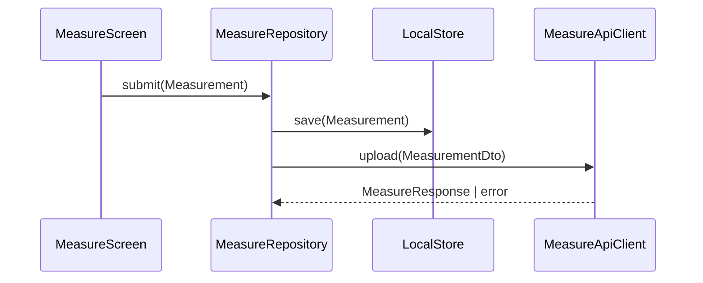
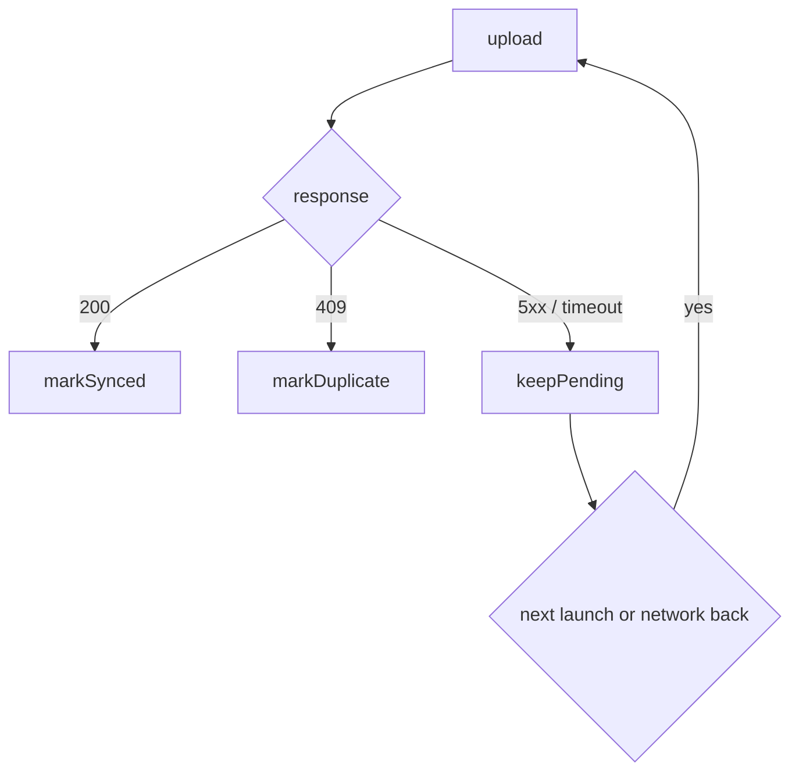

# Technical Review Docs (Outline)

> Read before writing or updating a technical review document on
> jubo.getoutline.com (Outline) for a code reviewer.

## Tool

Use `mcp__seshat__*` directly — `get_document` to read the existing doc first
(read-before-write, avoid clobbering), `update_document` (title/text/publish:true)
to write. Do not reach for browser automation (`claude-in-chrome`) for anything
Outline-related — Seshat is the actual MCP integration for this instance.

## Sourcing

Every factual claim must cite a real `file:line` read during the session — no
inference. State this explicitly in the doc's own subtitle (e.g. "並非推測" for a
Chinese-language doc).

## Language

Match the doc's language to its actual audience. If the reviewer reads Chinese,
write the whole doc in Traditional Chinese — but keep existing in-app/domain
terminology (e.g. Japanese-origin UI terms the product already uses)
untranslated rather than retranslating it.

## Diagrams

For a flow/sequence section, prefer a real diagram over a text arrow-list
(bullets joined by ──▶) when the target renders one — Outline supports fenced
` ```mermaid ` blocks. Rendering can't be verified without a connected browser,
so flag this explicitly to the user after writing, and be ready to revert to
the text-arrow form if it doesn't render.

Two diagrams, divided by the question each answers. They are not
interchangeable and one does not stand in for the other.

**A sequence diagram carries the API path** — who calls whom, in what order,
carrying what. Every participant is a real class or service boundary, never a
vague "App" or "Backend". Every message names the data shape it carries, not
just a verb. This is where the flow's entry points and the exact moment data
lands in local storage are read.



**A flowchart carries the decision paths** — under what condition each branch
is taken: each API error code's own handling, what survives when the app is
killed mid-flow, what triggers recovery on the next launch, when a retry fires
and under what bound. A sequence diagram's `alt`/`else` collapses once branches
multiply and converge; a flowchart carries them.



A single "failure" arrow is the shape to avoid — it collapses behaviours the
reviewer needs to tell apart. Each error code earns its own branch.

Every participant, message, and branch obeys the sourcing rule: a real
`file:line` for the code behind it. A branch you go looking for and cannot
find is not drawn as though it exists — an unhandled error code, an endpoint
nothing calls, a recovery path absent from the code. Those are absences, and
they belong in the gaps section under the scoping rule below, never in the
descriptive flow.

## Code citations

Class/type name only — drop inheritance chains ("extends X") unless
specifically relevant to the point being made.

## Section structure

Keep a purely descriptive "how it actually works" section (flow, triggers,
tables of real behavior) strictly separate from any "gaps/known issues/todo"
section — never collapse one into the other.

If a gaps/todo section is included at all, scope it explicitly to the
branch/PR actually under review (its own new code); tag or fully separate
pre-existing debt discovered along the way rather than blending it in as the
same category of finding.

## Visual alarm styling

Reserve strong visual alarm styling (red boxes, warning colors) for genuine
silent-failure risks — not for "two things are implemented via different
mechanisms but both actually work," which is nuance, not a red flag.

## Editing on request

Default toward trimming over adding. When the user asks to remove something,
remove exactly what they named and nothing more — don't leave
explanatory/justification paragraphs behind defending why content was scoped
the way it was. State facts, skip the meta-narration.

## Out of scope by default

- PDF export/conversion of the doc.
- A "known gaps" section by default — many review docs end up pure factual
  workflow description, zero gaps content.
- Explanatory preambles justifying scope decisions inside the doc body.
